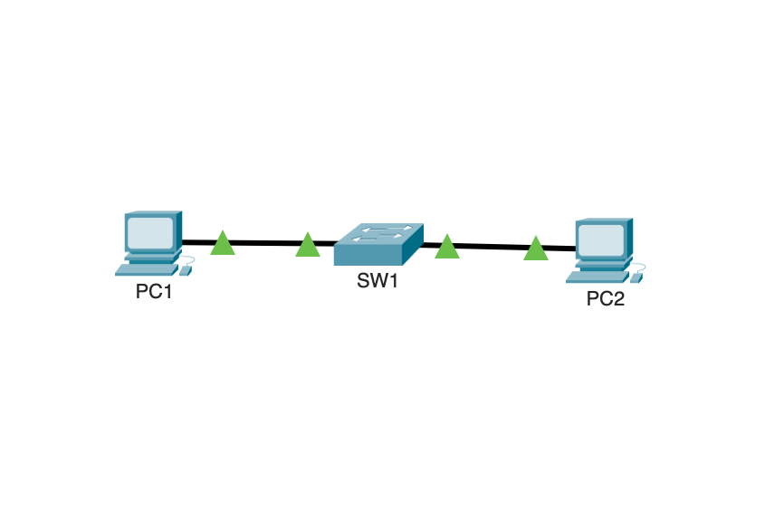

# Lab 01 - VLAN

## 🎯 Objectif

Créer et configurer deux VLAN sur un switch Cisco afin de séparer deux réseaux.

L'objectif est également de vérifier que deux machines appartenant à des VLAN différents ne peuvent pas communiquer sans routage inter-VLAN.

---

## 🖥️ Topologie



### Équipements utilisés

- 2 PC
- 1 switch Cisco 2960
- 2 câbles Ethernet

### Organisation du réseau

- PC1 → VLAN 10 (INFORMATIQUE)
- PC2 → VLAN 20 (RH)

---

## 🌐 Plan d'adressage

| Équipement | Adresse IP | Masque | VLAN |
|------------|------------|--------|------|
| PC1 | 192.168.10.10 | 255.255.255.0 | VLAN 10 |
| PC2 | 192.168.20.10 | 255.255.255.0 | VLAN 20 |

Aucune passerelle par défaut n'est configurée car aucun routage inter-VLAN n'est nécessaire pour ce lab.

---

## ⚙️ Configuration

### Création des VLAN

Les deux VLAN sont créés sur le switch :

```cisco
enable
configure terminal

vlan 10
name INFORMATIQUE
exit

vlan 20
name RH
exit
